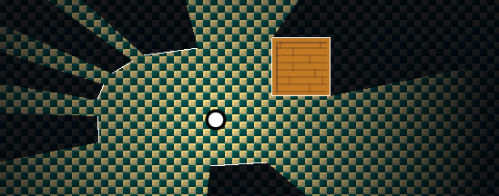

# Lua/Löve2D Lighting and Shadow Algorithm 💡

This is my Lua implementation of a 2D lighting/visibility algorithm using the Löve2D Framework. The algorithm to calculate the lit area is based on [this video](https://youtu.be/fc3nnG2CG8U?list=LL) by the amazing **One Lone Coder**.

The result looks something like this:

## Explanation:

I am currently working on a write up of the whole thing. Stay tuned.