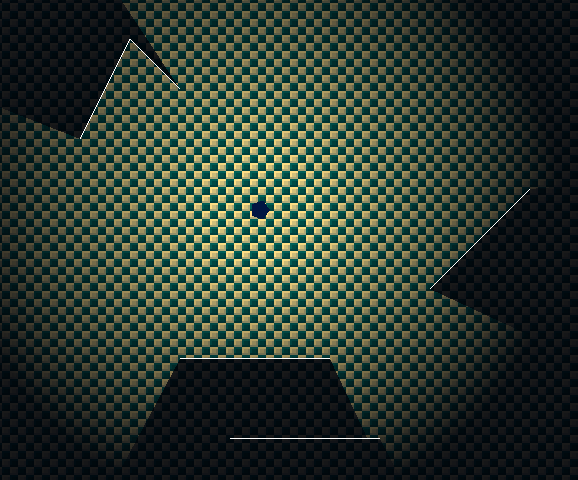

# Lua/Löve2D Visibility Algorithm

This is my Lua implementation of a 2D visibility algorithm with the Löve2D Framework.

The algorithm is based on [this video](https://youtu.be/fc3nnG2CG8U?list=LL) by **One Lone Coder**.
